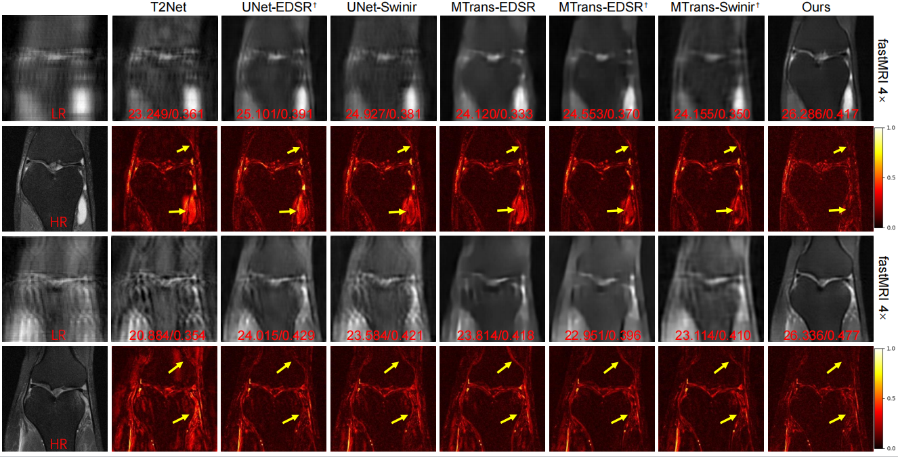

# Cross-contrast Mutual Fusion Network for Joint MRI Reconstruction and Super-Resolution

> **Authors:**
> Yue Ding,
> [Tao Zhou](https://taozh2017.github.io/),
> Lei Xiang,
> Ye Wu.


## 1. Preface

- This repository provides code for "_**Cross-contrast Mutual Fusion Network for Joint MRI Reconstruction and Super-Resolution (CMF_Net)**_". 
([paper](https://www.sciencedirect.com/science/article/pii/S0031320323002558))

- If you have any questions about our paper, feel free to contact me. And if you are using CMF_Net for your research, please cite this paper ([BibTeX](#4-citation)).


### 1.1. Table of Contents

- [Cross-contrast Mutual Fusion Network for Joint MRI Reconstruction and Super-Resolution]
  - [2. Overview](#2-overview)
    - [2.1. Introduction](#21-introduction)
    - [2.2. Framework Overview](#22-framework-overview)
    - [2.3. Qualitative Results](#23-qualitative-results)
  - [3. Train](#3-train)
  - [4. Citation](#4-citation)
  - [5. License](#5-license)

<small><i><a href='http://ecotrust-canada.github.io/markdown-toc/'>Table of contents generated with markdown-toc</a></i></small>


## 2. Overview

### 2.1. Introduction

Magnetic Resonance Imaging (MRI) is a widely used medical imaging technique that has become an essential tool for diagnosing various diseases and visualizing internal structures and tissues in the human body.
MRI reconstruction and super-resolution are two techniques that can enhance image quality and accelerate the imaging process. However, current methods perform these tasks independently and fail to consider
the correlations between them. Additionally, multi-contrast SR methods typically concatenate features from different contrasts without considering their correlation. In this paper, we propose a novel Cross contrast Mutual Fusion Network (CMF-Net) that performs joint MRI reconstruction and super-resolution by enabling mutual propagation of feature representations between the two tasks. The CMF-Net framework consists of two stages: the first stage focuses on fusing multi-contrast features, while the second stage aims to learn task-specific information for joint MRI reconstruction and super-resolution. We propose a Multi-contrast Feature Aggregation (MFA) module to facilitate the integration of multi-contrast features. This module captures multi-scale information from auxiliary contrast to enhance the feature representation’s capability. Furthermore, a Multi-task Mutual Fusion (MMF) module is presented to integrate task-specific features, which explores the correlation between the two tasks to improve MR super-resolution performance. We evaluate the proposed CMF-Net approach on two public MR datasets. Quantitative and qualitative results demonstrate that our CMF-Net outperforms other state-of-the-art methods.

### 2.2. Framework Overview

<p align="center">
     <br />
    <em> 
    Figure 1: Overview of the proposed CMF_Net.
    </em>
</p>

### 2.3. Qualitative Results

<p align="center">
     <br />
    <em> 
    Figure 2: Qualitative Results.
    </em>
</p>

## 3. Train

The experiments are conducted using [PyTorch](https://github.com/pytorch/pytorch) with 
a single NVIDIA GeForce RTX 3090 with 24 GB Memory.


1. Data Prepare:
   We used two public datasets for our experiments: fastMRI and ISLES. 
    
    + For [fastMRI](https://fastmri.med.nyu.edu/), we experimented with knee images in two modalities: PDWI and FS-PDWI.
    
    +  For [ISLES](https://www.sciencedirect.com/science/article/abs/pii/S1361841516301268), we experimented with brain images in two modalities: T1WI and T2WI.
   
1. Dependencies:
   * numpy==1.18.5
   * scikit_image==0.16.2
   * torchvision==0.8.1
   * torch==1.7.0
   * runstats==1.8.0
   * pytorch_lightning==0.8.1
   * h5py==2.10.0
   * PyYAML==5.4

1. Train
   ```bash
   cd experimental/CMFNet/
   python3 train.py
   ```

## 4. Citation

Please cite our paper if you find the work useful: 
    
    @article{DING2024110599,
      title={Cross-contrast mutual fusion network for joint MRI reconstruction and super-resolution},
      author={Yue, Ding and Zhou, Tao and Lei, Xiang and Ye, Wu},
      journal={Pattern Recognition},
      volume={154},
      pages={110599},
      year={2024},
      publisher={Elsevier}
    }


## 5. License

The source code is free for research and education use only. Any comercial use should get formal permission first.

---

**[⬆ back to top](#0-preface)**
